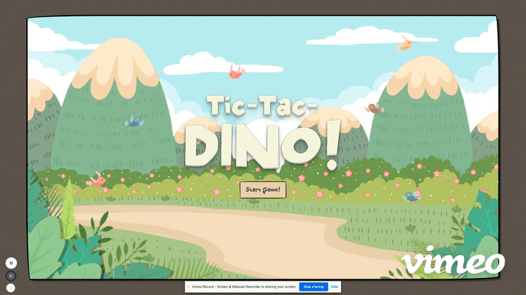
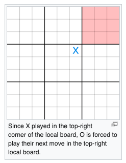
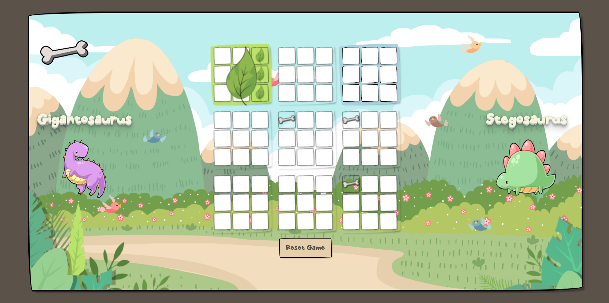
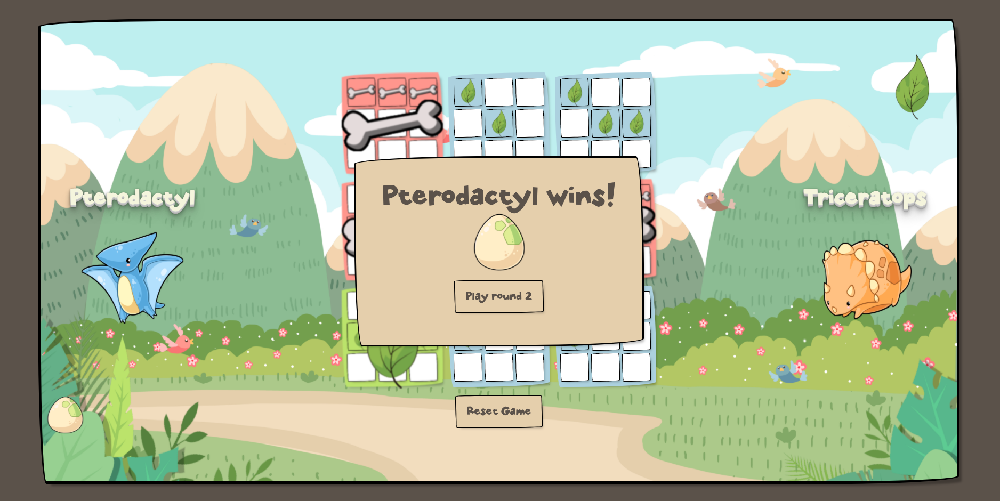
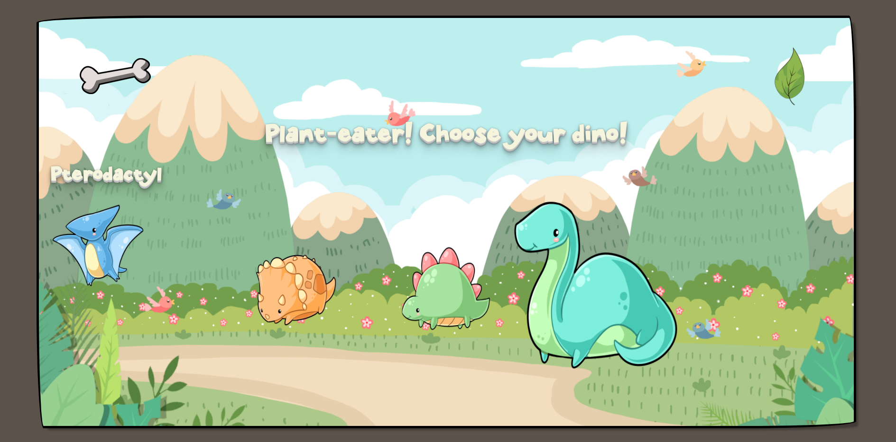

### General Assembley Software Engineering Immersive Course

# Tic-Tac-Dino!
Play Tic-Tac-Dino! [Here](https://ketka82uk.github.io/Tic-Tac-Dino/)

## In a land before time...

### The brief

**Them:** You have 1 week to go away on your own and create a 2D grid-based browser game using Javascript, HTML and CSS. Go!

**Me:** ...

### Ultimate Tic-Tac-Toe (with added dinosaurs)
This was my first project on my GA course after only a few weeks of tuition, and to say I was a little nervous going into it would be the understatement of the year. But I did what I always do in times of indecision and crisis - let my six-year-old decide what to do next. She wanted Ultimate Tic-Tac-Toe with dinosaurs, so that's what she got.

If you're not familiar with the rules of Ultimate Tic-Tac-Toe then you can read them [here](https://en.wikipedia.org/wiki/Ultimate_tic-tac-toe). Sadly, it's a little more complicated than regular tic-tac-toe as I was about to find out...

### Technologies Used
* Javascript
* HTML
* CSS

## The logic

### Creating the grid
First the easy part... creating a main board, which was made up of a 3x3 grid containing 9 elements called smallBoard. This was created using a simple for loop. Within each smallBoard I then created a further 3x3 grid composed of 9 cells using another for loop. The board was now set!

~~~javascript
// A for loop that sets up the main board as a 3*3 grid
for (let index = 0; index < width ** 2; index++) {
  const smallBoard = document.createElement('div')
  smallBoard.classList.add('small-board')
  smallBoard.classList.add('active')
  mainBoard.appendChild(smallBoard)
  smallBoard.style.width = `${95 / width}%`
  smallBoard.style.height = `${95 / width}%`
  smallBoard.setAttribute('id', `${smallBoardIds[index]}`)
 
  // A for loop that sets up 3*3 cells within each smallBoard
  for (let index = 0; index < width ** 2; index++) {
    const cell = document.createElement('div')
    cell.classList.add('cell')
    smallBoard.appendChild(cell)
    cells.push(cell)
    cell.style.width = `${90 / width}%`
    cell.style.height = `${90 / width}%`
    cell.setAttribute('id', `${smallBoard.id}${index}`)
    cellIds.push(cell.id)
~~~

### Leaves and bones
I decided to forgoe the usual Xs and Os, in favour of bones and leaves, befitting my herbivore vs carnivore theme. Once the board was set up, the next stage was to populate it with those bones and leaves as the players set down their markers. I did this by using classList to add classes to cells and creating a click event listener that checks for the following each time a player clicks on a cell:

* is the player a herbivore or a carnivore?
* is the cell empty or does it already contain a player marker (bone or leaf?)
* is the smallBoard containing the cell active or has it already been won or tied?

~~~javascript
if (currentPlayer === 'carnivore'
        && !cell.classList.contains('bone')
        && !cell.classList.contains('leaf')
        && smallBoard.classList.contains('active')
        && !smallBoard.classList.contains('carnivore')
        && !smallBoard.classList.contains('herbivore')
        && !smallBoard.classList.contains('tie')) { //carnivore goes first
        cell.classList.add('bone') // adds class bone to cell
        boneMarkers.push(cell.id)`
~~~

If the necessary conditions are met then the player can place their marker.

I also couldn't help myself and added a bunch of sounds and animations inside the same event listener, because, hey, this was supposed to be fun!

~~~javascript
if (currentPlayer === 'herbivore') {
        herbivoreGo.remove()
        bonePicture.appendChild(carnivoreGo)
        carnivoreGo.classList.add('animate__animated', 'animate__heartBeat')
        audio.src = 'sounds/leaf.mp3'
        audio.play()
      } else if (currentPlayer === 'carnivore') {
        carnivoreGo.remove()
        leafPicture.appendChild(herbivoreGo)
        herbivoreGo.classList.add('animate__animated', 'animate__heartBeat')
        audio.src = 'sounds/bone.mp3'
        audio.play()
      }
~~~

### Boards, boards, boards
So how do you win a game? Well, that was the tough part. Firstly, as per the rules of the game, once a marker has been placed, play then moves to the smallBoard that corresponds to the position of the last clicked cell, as per the diagram below (courtesy of wikipedia):

The easiest way around this issue was to give every cell an index (0-8) and each smallBoard an ID (A-I). Therefore, if the latest marker placed was in a cell with an index of 0, then play would move to smallBoard A (unless that board was already won or tied and therefore out of the game). If smallBoard A is disabled then play would move to ANY active board. My code for this was a bit of a beginner's copy/paste hack job (I had been doing this for three weeks at this stage), but it worked:

~~~javascript
if (index === 0) {
          // grabs next active board
          const activeBoard = document.getElementById('A')
          if (boards.A.won === false && boards.A.drawn === false) {
            activeBoard.classList.add('active')
            activeBoard.classList.remove('disabled')
          } else {
            smallBoards.forEach(smallBoard => smallBoard.classList.add('active'))
            smallBoards.forEach(smallBoard => smallBoard.classList.remove('disabled'))
          }
        } else if ... etc etc etc for about 900 lines
~~~

### Winning a board
Ah, the win conditions... I hadn't quite grabbed the concept of DRY by this point, so most of the code is pretty WET (Wandering Elongated Trash), but again, it works. Each time a marker is placed, the code checks if a win condition has been met - i.e has the player placed three bones/leaves in a row? If a win condition is met then that smallBoard is taken out of play and a sticker div placed over it to show the winner.

### It's a draw!
Along with checking for win conditions, the event listener also checks if the smallBoard is tied. This was a surprisingly tough nut to crack, and basically adds up the number of empty cells in the smallBoard by placing them in a new array. If the length of the array is zero and no win condition has been met, then the board is drawn.

~~~javascript
function checkForTie(activeBoard) {
  let currentBoard = ''
  for (let i = 0; i < smallBoards.length; i++) {
    if (activeBoard === smallBoards[i].id) {
      currentBoard = smallBoards[i]
    }
  }
  const children = Array.from(currentBoard.children)
  let emptyCells = 0
  for (let i = 0; i < children.length; i++) {
    if (!children[i].classList.contains('leaf') && !children[i].classList.contains('bone')) {
      emptyCells++
    }
  }
  if (emptyCells === 0 && !boards[activeBoard].won) {
    console.log('board is a tie!')
    currentBoard.classList.add('tie')
    boards[activeBoard].drawn = true
  }
}
~~~

### Winning the game
To win a game, a player needs to win three smallBoards in a row, just like in regular Tic-Tac-Toe. This involved a whole new set of win conditions that ran when a smallBoard was won. Each time a smallBoard was won, the code ran a function to see if the player had met the ultimate win condition, by checking for an overall round win:

~~~javascript
function checkRoundWin() {
  for (let i = 0; i < roundWinConditions.length; i++) {
    const roundWin = roundWinConditions[i]
    if (carnivoreWins.includes(roundWin[0]) && carnivoreWins.includes(roundWin[1]) && carnivoreWins.includes(roundWin[2])) {
      return carnivoreWinsRound = true
    } else if (herbivoreWins.includes(roundWin[0]) && herbivoreWins.includes(roundWin[1]) && herbivoreWins.includes(roundWin[2])) {
      return herbivoreWinsRound = true
    }
  }
}
~~~

### Egg collecting
Not content with just ending the game there, I also implemented a round system involving the winning of eggs. Win the round and a div pop-up appears to let you know you've won an egg. The egg then appears underneath your dinosaur. Get to three eggs and you're crowned the ultimate Tic-Tac-Dino winner!

## The user experience

### Interactivity
Because I was making this game for my daughter, I wanted to make it as fun as possible, using animations and sounds to make the experience feel immersive. From the sound effects each time a marker is placed, to the dinosaur roar every time a round is won, right through to the little dance your dino does after you win three rounds! I also wanted to make it feel more interactive by giving the player the opportunity to choose their dinosaur, providing an option of three herbivores and three carnivores for each player.

### Look and Feel
The look and feel was by far the biggest part of this project for me. I knew my coding skills were still in their early stages but I felt I could make up for that with some cute design ideas that made the app great to look at. I used a number of different resources for the graphics and sounds (noted below). I also looked up a number of CSS techniques to achieve the border and font effects, using flexbox to align everything:

~~~javascript
.start-page {
  background: url('graphics/cartoon-mountain-background.jpg');
  background-size: cover;
  position: absolute;
  display: flex;
  justify-content: center;
  align-items: center;
  align-content: center;
  flex-direction: column;
  margin: 20px;
  width: 90%;
  height: 90%;
  padding-top: 20px;
  padding-bottom: 20px;
  box-shadow: 10px 10px 4px -6px hsla(0,0%,0%,.3);
  border-radius: 255px 15px 225px 15px/15px 225px 15px 255px;
  border: 5px solid black;
}
~~~

## Next time...

### Improvements
Overall I'm really pleased with the way this project turned out, but if I ever get the chance to improve it, there are a number of things I'd like to do:

* First off, refactor the code and make much better use of fucntions and make better use of DRY and KISS principles. I was still a little unsure on how to use scope when I created this app, and there are a lot of improvements that can be made under the hood!

* There are a few minor formatting issues which bug me. For example, the cell hover effect still works on disabled smallBoards and I'd like to remove the blur effect from the leaf/bone stickers and just keep it to the cells below.

* The game only really runs on Chrome and on a wide screen so making it Safari and mobile friendly would definitely be a plus!

### Future additions
The obvious one here is a computer AI opponent! I'd love to add one of those one day! Along with player vs player online.

Oh, and a rules page could be handy!

### Bugs squished (and not-so-squished)
Only one big bug with this one - after round one the function to check if a smallBoard is tied doesn't work properly. I'm pretty sure that this has something to do with the additonal div stickers that are added to the board to show when a smallBoard has been won or drawn and these divs are not being removed properly at the end of each round. Definitely something to fix soon!

## Assets
I used the following assets for this project:

* Dinosaur images by [DigitalArtsi](https://www.etsy.com/uk/shop/DigitalArtsi?ref=simple-shop-header-name&listing_id=630380102) on [Etsy](https://www.etsy.com)
* Sounds from [ZapSplat](https://www.zapsplat.com)
* Background image from [pngtree](https://pngtree.com/)
* Title font is StoneHinge from [myfonts.com](https://www.myfonts.com/)
